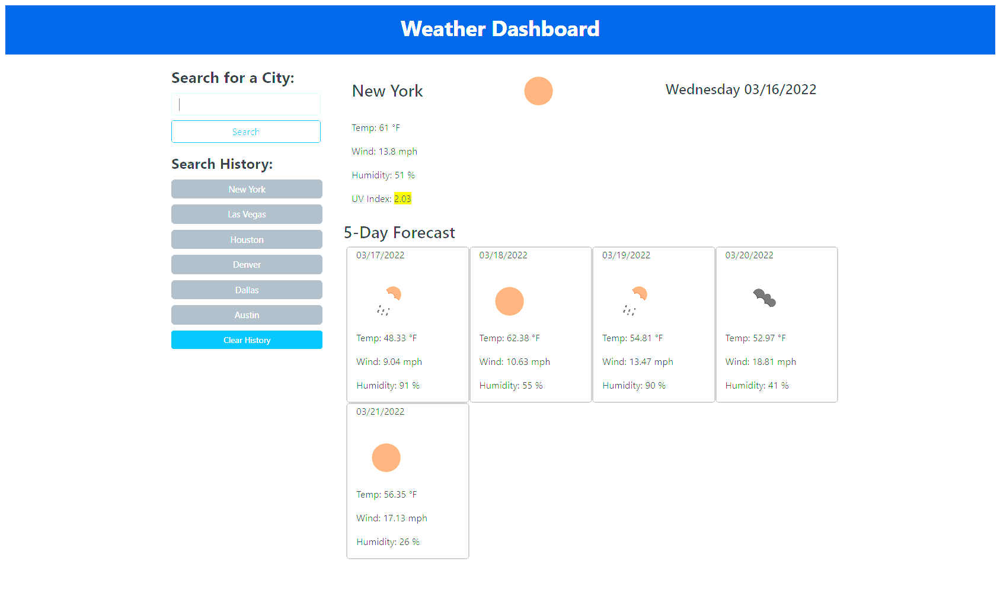

Challenge 6: Current and Weekly Weather Forecast

In this challenge, I used server-sided APIs to fetch and manipulate data to display the current weather and a five day forecast for the searched city. The current weather dashboard displays temperature, wind speed, humidity, and UV index. Using HTML, CSS, and Bootstrap, I was able to structure and style each display on the application. The search history is also displayed using local storage with a "clear history" button to clear all of the past search history. 

User Story:
As a traveler, I want to see the weather outlook for multiple cities, so that I can plan a trip accordingly.

Acceptance Criteria:
Given a weather dashboard with form inputs, when I search for a city, then I am presented with current and future conditions for that city and that city is added to the search history. When I view current weather conditions for that city, then I am presented with the city name, the date, an icon representation of weather conditions, the temperature, the humidity, the wind speed, and the UV index. When I view the UV index, then I am presented with a color that indicates whether the conditions are favorable, moderate, or severe. When I view future weather conditions for that city, then I am presented with a 5-day forecast that displays the date, an icon representation of weather conditions, the temperature, the wind speed, and the humidity. When I click on a city in the search history, then I am again presented with current and future conditions for that city.

Link to Deployed Application: https://joshahuynh.github.io/weather-dashboard/

Link to the GitHub Repository: https://github.com/joshahuynh/weather-dashboard

Screenshot of Application:

